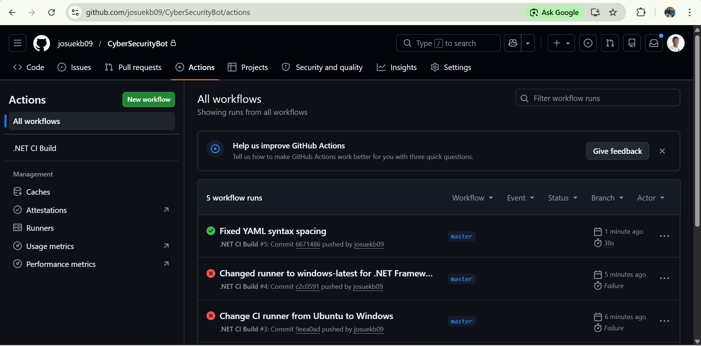

# Cybersecurity Awareness Bot

**Student Name:** Kabuya Tambwe Josue
**Student Number:** ST10468057

A fully functional WPF GUI-based chatbot developed in C# and .NET 8.0 that educates users on online safety.

## Implemented Features (Part 2)
- **WPF Terminal Interface:** A customized dark-themed layout with custom navy and cyan styling properties.
- **Voice Greeting & ASCII Art:** Reusable audio greeting track and synchronous ASCII banner display on initialization.
- **Keyword Recognition Engine:** Handles dynamic security token processing using optimal dictionary lookups for keywords like password, phishing, privacy, scam, and browsing.
- **Advanced User Memory Store:** Remembers user identities and topics of interest systematically throughout the chat flow.
- **Sentiment Classification Engine:** Catches worried, curious, or frustrated tones and fires empathetic responses with auto-chained technical tips.
- **Context Continuations:** Preserves tracking states to handle chained prompts like 'tell me more' seamlessly[cite: 1, 2].

## Prerequisites
- Visual Studio 2022
- .NET 8.0 Runtime
- Windows OS

## How to Run the Application
1. Clone the repository to your local machine.
2. Open the solution file `CyberSecurityBot.slnx` or `.sln` in Visual Studio 2022.
3. Ensure the `greeting.wav` file property is set to 'Copy always'.
4. Press `F5` or click the "Start" button to compile and run.

## Video Presentation Walkthrough
Watch the full application demonstration walkthrough video here:
https://youtu.be/zZqXzUhyUxY

## Continuous Integration (CI) Status

